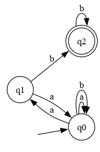
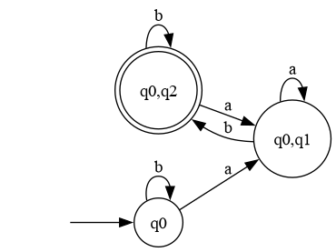

# Determinism in Finite Automata. Conversion from NDFA 2 DFA. Chomsky Hierarchy.

### Course: Formal Languages & Finite Automata
### Author: Soimu Ionut (Variant 23)

----

## Theory
A finite automaton (FA) is a mathematical model of computation consisting of states, transitions, an initial state, and a set of final states. The "finite" characteristic means processes modeled by an FA have a beginning and, possibly, an end.

When an automaton features single, unique transitions for each state and input symbol combination, it is known as a **Deterministic Finite Automaton (DFA)**. However, if there are multiple possible transitions for the same symbol from a given state, the automaton becomes a **Non-Deterministic Finite Automaton (NDFA** or **NFA)**. This non-determinism introduces unpredictability regarding which computational path the input might take, meaning the model tracks multiple potential states simultaneously.

According to theoretical computer science, any NDFA can be converted to an equivalent DFA that recognizes the same language. This eliminates non-determinism by grouping non-deterministic choices into "macro-states" (often using powerset construction), creating a completely deterministic sequence of events.

Additionally, formal grammars can be categorized based on the restrictiveness of their production rules. This grouping is called the **Chomsky Hierarchy**, organized from Type 0 (Unrestricted) to Type 3 (Regular Grammars), giving insight into a grammar's complexity and the required parsing mechanisms.

## Objectives:
1. Understand finite automata and their real-world applications.
2. Provide a function inside the `Grammar` class to classify grammars according to the Chomsky hierarchy.
3. Use the finite automaton associated with the assigned variant.
4. Implement the conversion of the finite automaton to a regular grammar.
5. Determine whether the defined FA is deterministic or non-deterministic.
6. Implement the conversion from an NDFA (if applicable) to a corresponding DFA.
7. Represent the finite automaton graphically.

## Implementation description

This project continues the structural pattern established in the previous lab using Python. I implemented multiple functions to fulfill each objective sequentially.

### 1. Chomsky Hierarchy Classification
In `Grammar.py`, I introduced the `classify_chomsky()` method. It evaluates the properties of the rules in `self.P` to determine whether the grammar is Type-3, Type-2, Type-1, or Type-0.
- **Type 3 (Regular)**: Checked for strict structure forms `A -> aB` or `A -> a`.
- **Type 2 (Context-Free)**: Handled by ensuring the left-hand side of every rule is strictly a single non-terminal variable.
- **Type 1 (Context-Sensitive)** and **Type 0 (Unrestricted)** follow automatically if preceding constraints fail but length constraints are respected.

### 2. FA Definition and Determinism Check
The initial configuration representing Variant 23 was built via the `FiniteAutomaton` class. To easily determine determinism:
```python
    def is_deterministic(self):
        for (state, symbol), destinations in self.transitions.items():
            if len(destinations) > 1:
                return False
        return True
```
For my variant, the presence of transitions `δ(q0,a) = q0` and `δ(q0,a) = q1` violates determinism, correctly identifying it as a Non-Deterministic Finite Automaton (NDFA).

### 3. Conversions (`to_grammar()` and `to_dfa()`)
- **NDFA to Grammar (`to_grammar`)**: I mapped states to Non-Terminals ($V_N$) and input symbols to Terminals ($V_T$). A transition from $q_0$ to $q_1$ on $a$ converts into the rule `q0 -> aq1`. An additional path to final production (`q0 -> a`) is created if $q_1$ is a final state.
  
- **NDFA to DFA (`to_dfa`)**: To make the FA predictable, I utilized the subset (powerset) construction algorithm. I implemented a queue processing system traversing possible destination sets, merging non-deterministic overlapping into unified single states (e.g. state `q0` + state `q1` becomes a composite state `"q0,q1"`). It proceeds systematically generating predictable branches until the processing loop empties out. 

```python
    def to_dfa(self):
        # ...
        while queue:
            current_dfa_state = queue.pop(0)
            # Find all reachable NFA states grouped logically
            # Create composited DFA nodes based on sets
```

### 4. Graphical Representation (`to_dot()` & system Graphviz)
For generating graphs, I added a function that exports `.dot` source blocks, formatted for Graphviz engine compatibility. The program can export models before and after conversion.

To fully satisfy the bonus point requirements robustly, I integrated support for the local system's **Graphviz** installation using Python's `subprocess` module. When the code is executed, the script generates the `.dot` instruction strings, drops them into a temporary file securely format, and invokes the system's `dot` command-line utility. It then writes the resulting diagrams directly to the local workspace folder as PNG images (`nfa.png` and `dfa.png`). This requires `graphviz` to be installed locally inside the operating system (e.g., via `paru` or `apt`), ensuring data privacy without relying on any external APIs.

**Original NFA:**


**Converted DFA:**


## Conclusions

In this laboratory work, I expanded my understanding of finite automata classification and the Chomsky hierarchy. Programmatically checking a grammar's Type constraints helped solidify the mathematical conditions that dictate parsing complexity. 

The highlight was engineering the subset construction algorithm capable of absorbing non-determinism (`q0 -> q0 | q1`) into distinct combined determinism (`"q0" -> "q0,q1"`). Handling iterables like frozensets simplified indexing these new composed states, successfully generating an equivalent DFA capable of acting computationally as a fully deterministic state machine. Finally, converting between automata and grammar logic re-demonstrated the inherent parity bridging different language representation formats.
